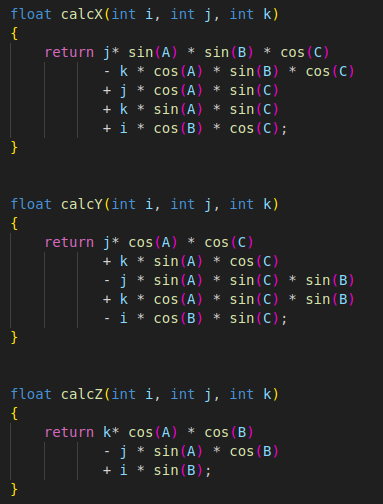
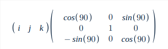
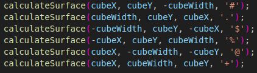

<h1 align="center">Rotacionando um cubo com Rotação de Matrizes</h1>

## Explicação de algumas teorias
### Rotação de matrizes

 
 

 
 As Funções <strong>Calcx, Calcy, Calcz</strong> se referem a multiplicações de matrizes, usando matrizes de rotação , que levam o vetor(i j k ) para um vetor rotacionado (i' j' k'), com base nos ângulos a,b,c 

  

 ### Projeção em perspectiva, Função calculateSurface
 
Na função calculateSurface foram utilizadas conceitos de projeção de perspectiva, com o objetivo de representar objetos tridimensionais (3D) em uma superfície bidimensional (2D). Nesse contexto, a variável  <strong>ooz</strong> é o inverso da profundidade, isso significa que quanto mais distante o ponto está da câmera, menor será o valor de <strong>ooz</strong>. Para calcular as variáveis <strong>xp, yp</strong>,foram utilizadas fórmulas de projeção em perspectiva, em que <strong>width</strong> se refere a largura da imagem, <strong>K1</strong> é um fator de escala, <strong>ooz</strong> é o inverso da profundidade e <strong>x</strong> é a posição da coordenada x no espaço 3D. 

 
 
Por fim, é necessário fazer uma verificação de limites, garantindo que posições inválidas do array não serão acessadas

 ### Adicionando novas superfícies
 
Aqui são adicionados  novas superfícies, totalizando as 6 do cubo, que são calculadas colocando entradas na matriz de rotação de forma a criar superfícies ortogonais. Exemplo abaixo, utilizando a matriz de rotação do eixo y. 

